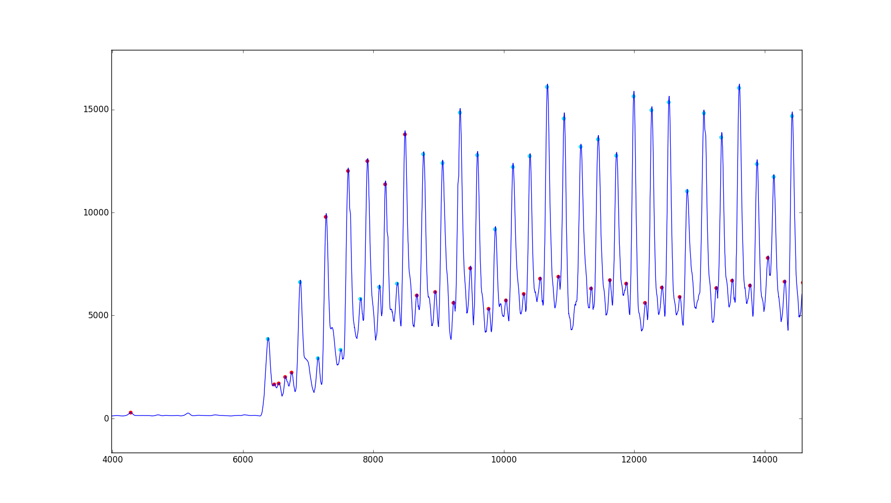
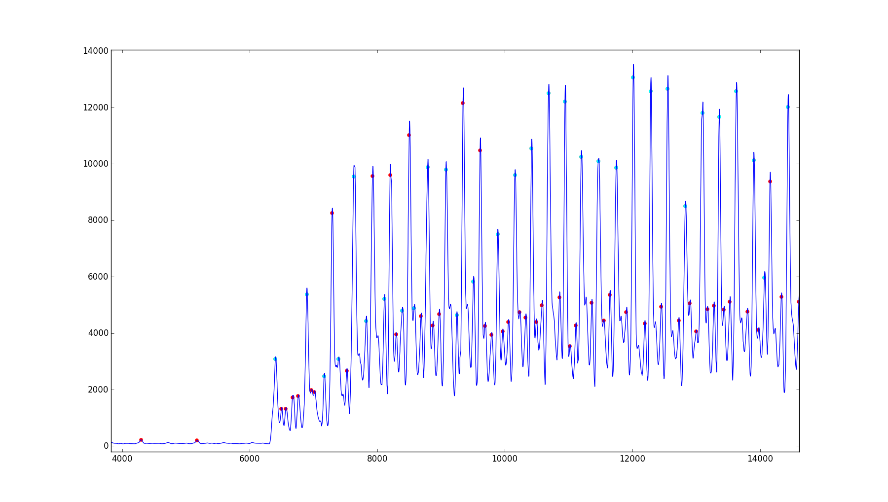

# Speed Bag Counter

## Filtering the data

All plots except for the last section are from the 3-77hits.txt data set.

First we examine the raw data, which looks like this for x,y,z, accel values:

I thought the signal was strongest in the z component, so I only used that for my approach.

Let's look at only the first ~10000 milliseconds for the z component.

Like most people in the comments, I used the magnitude of the
 (mean-subtracted) values. Since user waltemus had good success with a low pass filter, I decided to use a smoothing approach as well.

## First approach: get all the bag-platform hits!

I also tried filtering them by taking a weighted average of 59 points (the weights are given by a Gaussian distribution). This results in peaks shown below. Usually, there is one big peak followed by about two smaller peaks, which I think is the bag hitting the platform. As you can observe from the videos, after each punch, the bag typically hits the platform 3 times before another punch. It might be some weird residual ringing on the platform though -- I'm not sure.

We first detect if we are at a local maximum, and then decide whether it's a hit. To detect whether we're at a local maximum, we calculate the "slope" by the difference between (Gaussian-smoothed) values at two successive time points. When the slope goes from being positive to negative (in a sliding window), we determine that we are at a maximum.

We use some heuristic thresholding to figure out which corresponded to big peaks (shown in cyan) from the other maxima (shown in red). The big peaks were then counted as hits. But this turned out to be a pain and not as accurate in general as the next approach (the data from the above plot looks very accurate, but on other parts of the data, it fails). I ended up with a decent algorithm, but it, among other things, encoded a hard limit of 140 ms of how fast hits can happen. If I was going to do that (i.e.  not allow super fast hits), I might as well smooth the data more, which will make it easier to detect hits!

## Second approach: one maxima per hit

Next, I tried smoothing the function even more so that I had one maximum per hit. The plot below shows what it looks like, this time using a low pass Butterworth filter rather than Gaussian smoothing. The two green and magenta lines are for thresholds for the maxima to be counted as a hit, and the peak only needs to be above one of the thresholds. There is one threshold for the magnitude, and another threshold for the difference between the magnitude and the most recent minimum. The thresholds increase when there have been a lot of hits recently, and decrease when it hasn't seen hits in a while. The threshold also decrease when the standard deviation of the hits is high.

Here's what it looks like for the whole data set

Note the rather rapid fall-off of heights of maxima after the punching has (presumably) stopped. After the last hit (the last point in cyan), the next maxima (in red) occurs significantly lower than it. However, it's actually still relatively high compared to the first maximum, which is a real "hit". The thresholding scheme needs to account for these facts, which means you need to hold on to some recent information.

## How to run the code

All the plots came from code written in python. After cloning the repository, running

  `python streaming.py`

should reproduce the last plot, as well as print out the number of hits. For other files, you can run, e.g.

`python streaming.py MysteryDataSet-1.txt`

I also wrote the corresponding code so that it compiles on an arduino IDE, in bagCounter/bagCounter.ino . If you want to run it, you should modify getAccelData() and also write desired behavior in updateCounter(). The code currently is too big for an arduino uno, as it uses around 3KB of dynamic memory. It does compile for an arduino mega. You can reduce this by reducing the number of hits (`num_hits_to_keep`) we remember (to calculate standard deviation), but this changes the output a bit. For example, if you set `num_hits_to_keep` to 70, you get all the same predictions except that for MysteryDataSet-2, the value is 155 rather than 156. Ideally, we would do some sort of streaming standard deviation without keeping all the values, but I have not implemented that yet.

I tested the code using just c code that ran the same functions, reading the relevant data, which I saved separately in the data/ subdirectory. This code is cprogram.c. Compiling and running this code should count 77 hits, using the 3tz.txt file.

Note that I tuned the parameters on the first three files with known hits, as well as visual observation of the mystery data sets. So only the 6-79hits.txt was a true testing set, and there may have been some overfitting.

## Concerns

1. Robustness: This approach probably will not work well if you hit fast enough that the bag bounces only once after each hit rather than three times. Starting with the higher frequency filter from the first approach would probably work better in this case, because you want to see narrower peaks. However, you would still need to tune it and have a better hit detection algorithm, which was hopeless for me to do without actual data with this sort of hitting pattern.

    In general, I feel like the data we were given were quite similar to each other in that there seemed to be 3 bag-platform impacts for each punch at regular intervals, so I don't know what would happen if you hit it in a different pattern.

2. Computing power and memory usage: I didn't actually run it on an arduino, but my approach does use a decent amount of computation and memory. As mentioned above, you can reduce memory usage by decreasing `num_hits_to_keep`.

## Improvements

1. Better thresholding: I'm not sure how to do this. As a human, I can tell (most of the time) when a hit happened, but it was surprisingly difficult to get my code to do the same. I think the first approach with a better thresholding scheme would work the best, but I couldn't come up with a good thresholding scheme that didn't have a lot of ad hoc rules, which is not a good sign.

    I think that another approach that would have had good performance is to go with the finer filter from the first approach and require having small peaks in between. We would register a hit if we saw a peak that was much higher than the previous peak(s) (which are presumed to be the small hits). However, this would clearly suffer from the robustness issue and require that there be more than one bag-platform impact per hit.

2. Try to use data from the x,y components: I didn't try to do this much. I thought the data from the z component should be enough, and it's not very clear how to use the data from the other components. I think the most effective way to use it might be to run each component through the hit detection pipeline, and then to declare a hit only if 2 of 3 of them think there has been a hit. For my approach, this was not good because I already was using a lot of processing power.

## Note on the Data

For me, it was more illuminating to look at the finer filtered data (from the first approach), because it showed more of what was going on.

Though I state above that the data have similar hitting patterns, it's interesting to note that the mystery data sets have hits that are more frequent and harder. This is why I think the threshold needs to be adaptive.

Plotting the raw values will show that the z values have a higher range. To deduce that the hits are also more frequent, we can see how spread apart the peaks are in the coarser filter (from approach 2), but here is another interesting way.

The finer filter from approach one only sees about 2 peaks (one small, one large) per presumed hit in the mystery data set, whereas it saw 3 peaks per presumed hit in the 77 hits set. (By the way, you can see my thresholding failing miserably here during the beginning, because it gets "out of sync" and the hard limit between peaks prevents the high peak from being registered as a hit after a low peak was mistakenly labelled as a hit):

If we think that these peaks represents bag-platform hits (though this conjecture might be terribly wrong), this seems weird. You can only punch the bag after an odd number of hits, so how come we are seeing only one small peak in between whereas previously, we were seeing two small peaks in between hits?

If we reduce the standard deviation of the Gaussian filter, then the two smaller peaks to separate out, as below. (Note this thresholding scheme wasn't tuned to this filter, but I find it useful to have some labelled maxima, so I left it.)

The conclusion is that lots of things can go wrong when you alter hitting rhythms, which is why I have concern #1. These plots convinced me, though, that my worry of 1 bag-platform bounce per hit didn't seem to be happening in the mystery data sets. If it did, I would expect there only to be large peaks, with no small peaks in between.
