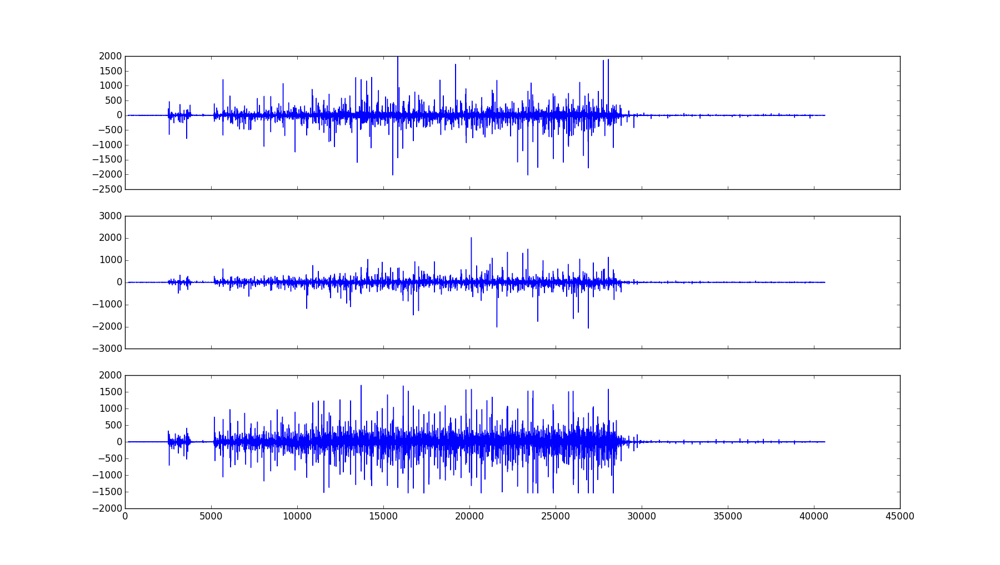
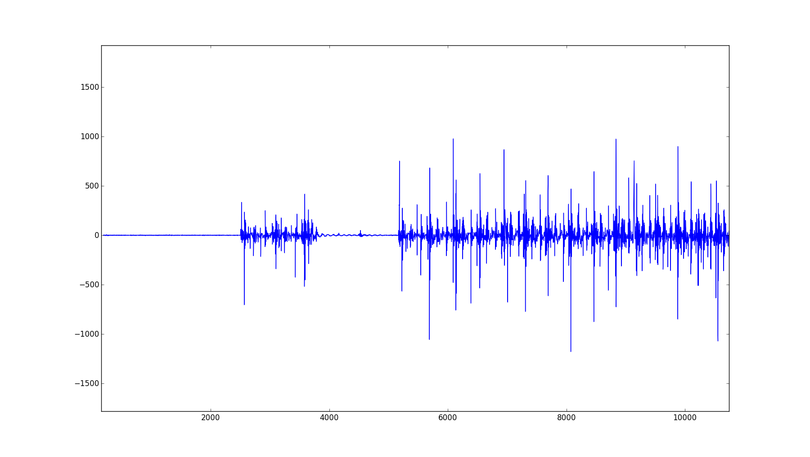
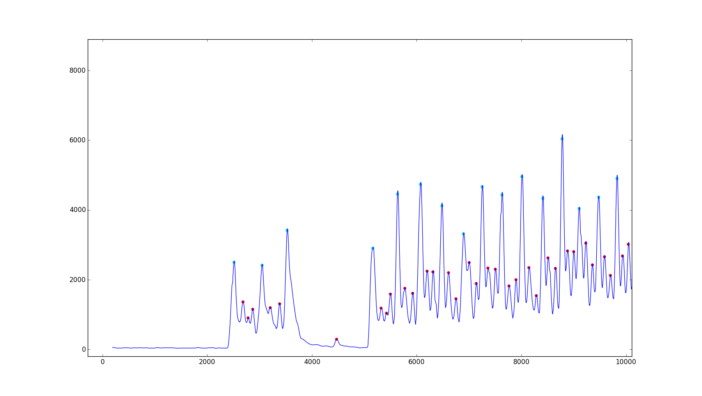
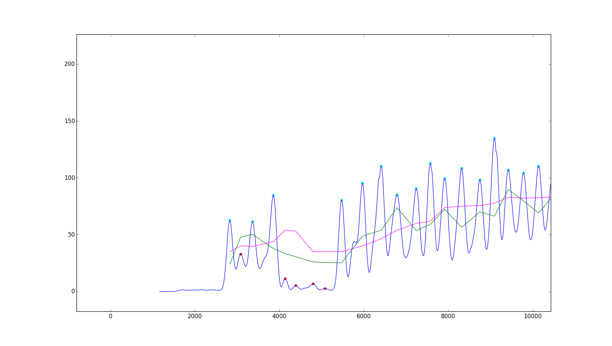
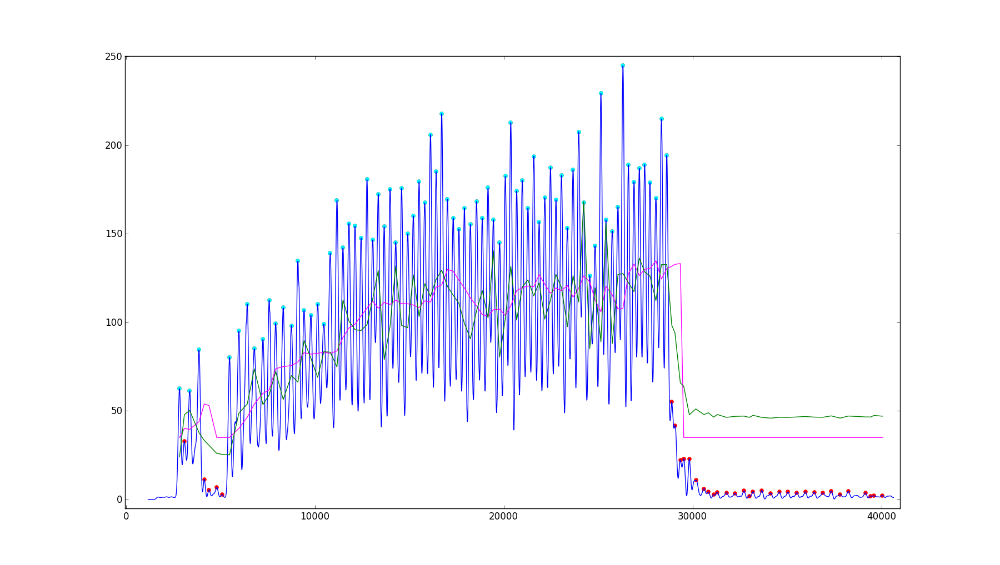

# Speed Bag Counter

All plots for here are from the 3-77hits.txt data set.

First we examine the raw data, which looks like this for x,y,z, accel values

I thought the signal was strongest in the z component, so I only used that for my approach.

Let's look at only the first ~1000 milliseconds for the z component.

Like most people in the comments, I used the magnitude of the
 (mean-subtracted) z acceleration component. Since user waltemus had good success with a low pass filter, I also tried filtering them by taking a weighted average of 59 points (the weights are given by a Gaussian distribution). This results in peaks shown below. Usually, there is one big peak followed by about two smaller peaks, which I think is the bag hitting the platform.

The maxima are found by finding when the slope changes direction, and there was some heuristic thresholding to figure out which corresponded to big peaks (shown in cyan) from the other maxima (shown in red). The big peaks were then counted as hits. But this turned out to be a pain and not as accurate in general as the next approach (the data from the above plot looks very accurate, but on other parts of the data, it fails).

I decided I wanted to smooth the function even more so that I had one maximum per hit. The plot below shows what it looks like. The two green and magenta lines are for thresholds for the maxima to be counted as a hit, and the peak only needs to be above one of the thresholds. There is one threshold for the magnitude, and another threshold for the difference between the magnitude and the most recent minimum. The thresholds increase when there have been a lot of hits recently, and decrease when it hasn't seen hits in a while. The threshold also decrease when the standard deviation of the hits is high.

Here's what it looks like for the whole data set

I'm concerned about robustness because this might not work well if you hit fast enough that the bag bounces only once after each hit rather than three times. The previous code might work better in this case, but you would still need to tune it, which I don't know how to do without the corresponding data.

All the above code was written in python; running

  `python streaming.py`

should reproduce the last plot, as well as print out the number of hits. For other files, you can run, e.g.

`python streaming.py MysteryDataSet-1.txt`

I also wrote the corresponding code so that it compiles on an arduino IDE, in bagCounter/bagCounter.ino . If you want to run it, you should modify getAccelData() and also write desired behavior in updateCounter(). The code currently is too big for an arduino uno, as it uses around 3KB of dynamic memory. It does compile for an arduino mega. You can reduce this by reducing the number of hits (`num_hits_to_keep`) we remember (to calculate standard deviation), but this reduces performance. Ideally, we would do some sort of streaming standard deviation without keeping all the values, but I have not implemented that yet.

I tested the code using just c code that ran the same functions, reading the relevant data, which I saved separately in the data/ subdirectory. This code is cprogram.c Compiling and running this code should count 77 hits, using the 3tz.txt file.

Note that I tuned the parameters on the first three files with known hits, as well as visual observation of the mystery data sets. So only the 6-79hits.txt was a true testing set, and there may have been some overfitting.
